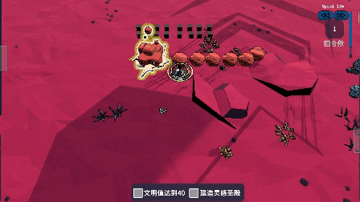
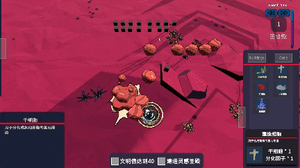
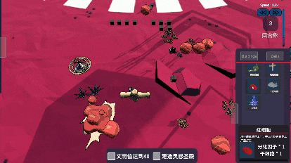
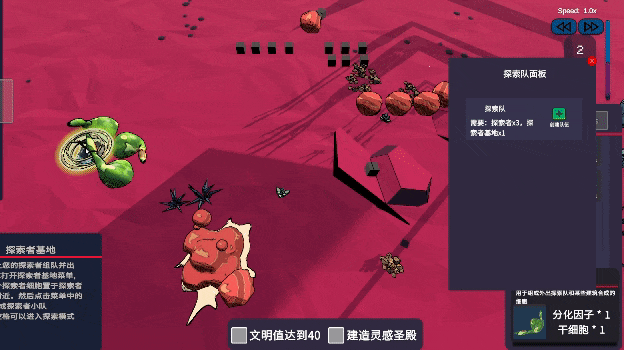
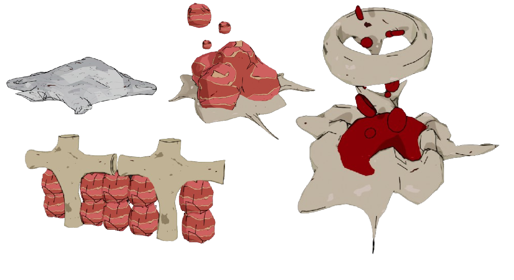

_# AI Native # RTS # Narrative_

## **Introduction**

Step into the shoes of Eve, a biological scientist endowed with a god-like touch, who receives a myriad of whimsical orders for cultivating organoids each day.
To bring these visions to life, players must gather various "inspirational DNA fragments" from diverse organisms and immerse them in the cultivation chamber, embarking on a journey to build a civilization of organoids.
As the city of organoids flourishes, the whispers of the cells grow clearer, civilizations begin to blossom, and the tales of their owners will gradually unfold like petals in the morning sun...

## **Research**

### _Organoid_

Organoids are delicate miniature structures, crafted from stem cells or tissue cells, nurtured in vitro to mirror the essence and function of real organs. Their emergence has opened new avenues in biomedical research, allowing for a more profound understanding of human organ development, the intricacies of disease, and the dance of drug responses.
In the realm of organoid research, many experiments delve into the regenerative cells found in deer antlers, simulating the intricate process of human epidermal renewal.
This journey of drawing inspiration from nature's creations to inspire human ingenuity in crafting "organoids" has ignited our imagination.
Thus, we envisioned a game where players, as scientists, weave together various inspirational organisms to create their own unique organs.
Through this experience, we hope players will not only discover the fascinating world of organoid research but also revel in the joy of "inspiration."

## **Game Play**

### _Step 1:_

Outside the game: Choose the orders you wish to fulfill and select the appropriate organs and inspirational organisms for AI synthesis.

### _Step 2:_

Inside the game: Engage in the delicate art of cell cultivation and management. As the cells flourish, a vibrant city will gradually emerge, giving rise to a rich tapestry of civilization.
The game encompasses various systems, including construction, turn-based mechanics, nutrition, and stress management.

Initial Stem Cells

Synthesize Architectural Cells

Synthesize Red Blood Cells

Dispatch Exploration Teams

### _Step 3:_

Once the organoids are successfully crafted, they will be delivered into the hands of their rightful owners. Throughout this nurturing process, players will gradually unveil the stories behind these orders, solving the mysteries that lie within.

## **Cells**

We have conjured approximately 17 types of structures, each representing a facet of the organoid cultivation journey.

