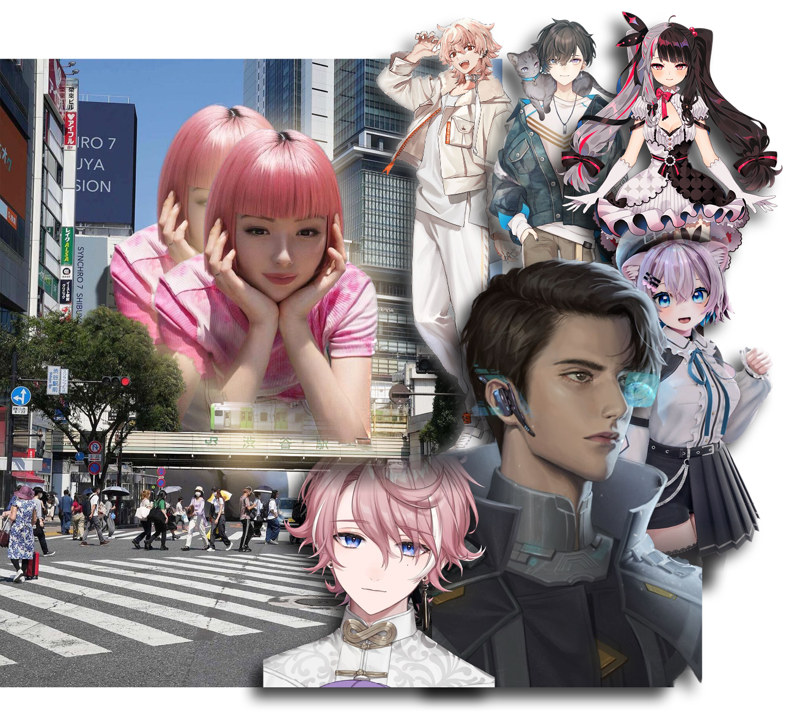
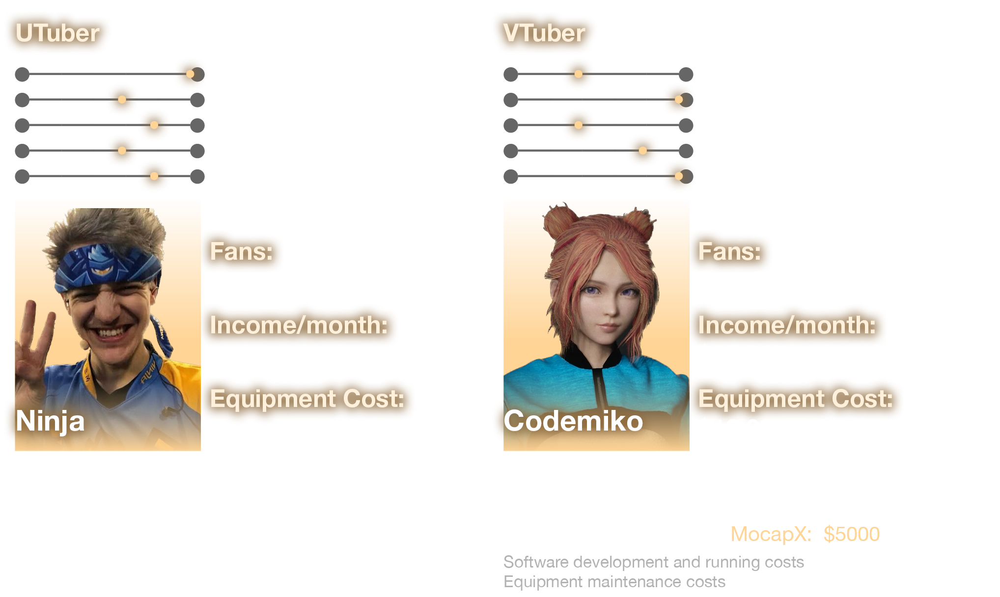
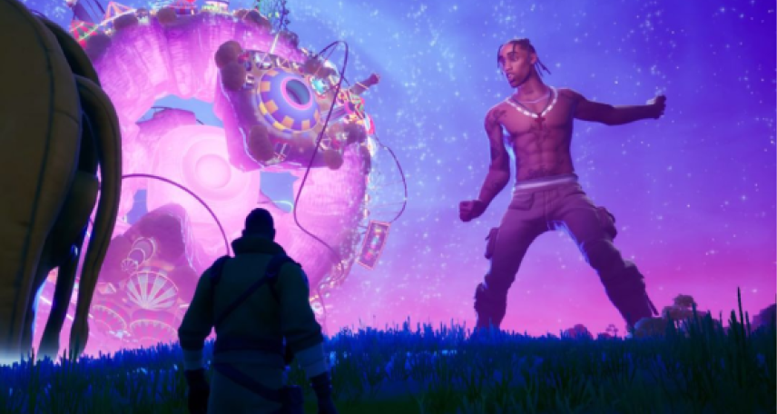
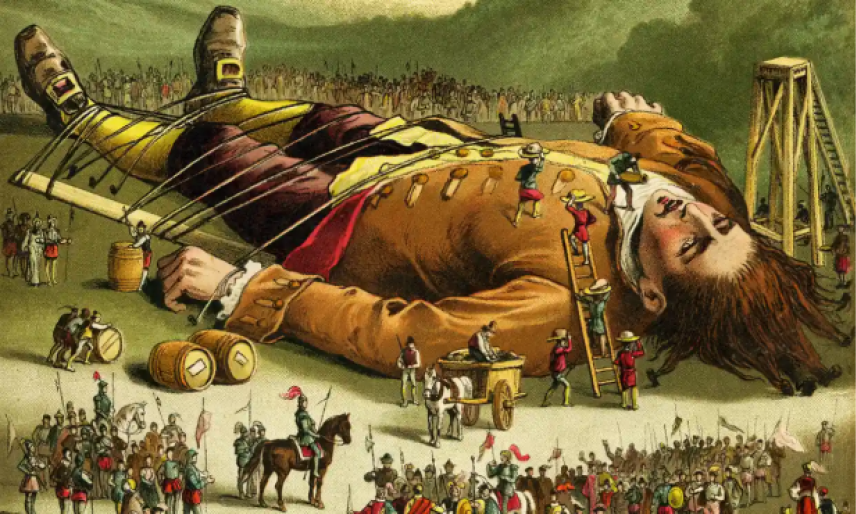
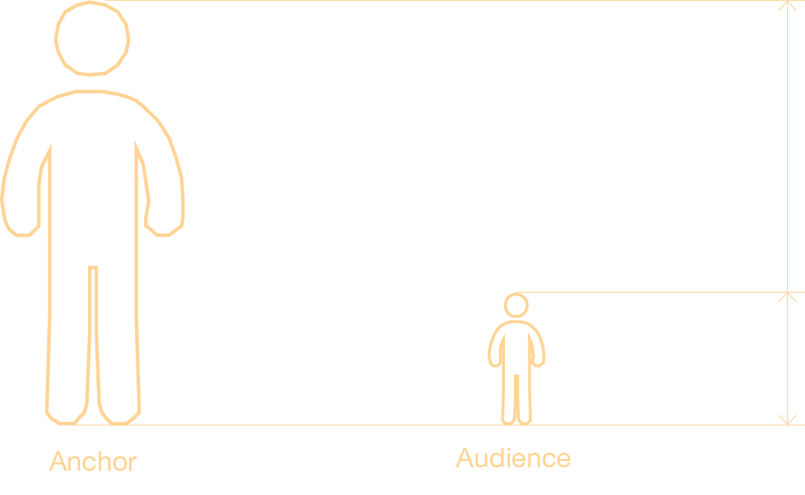
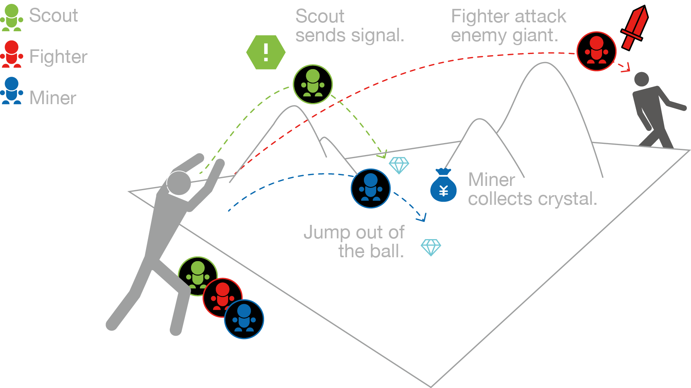
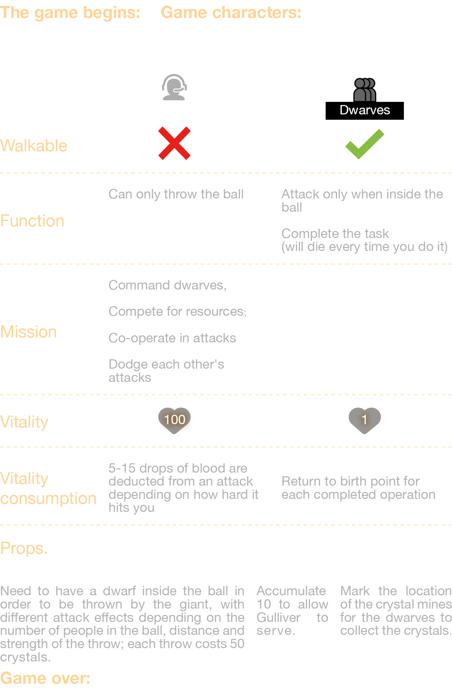
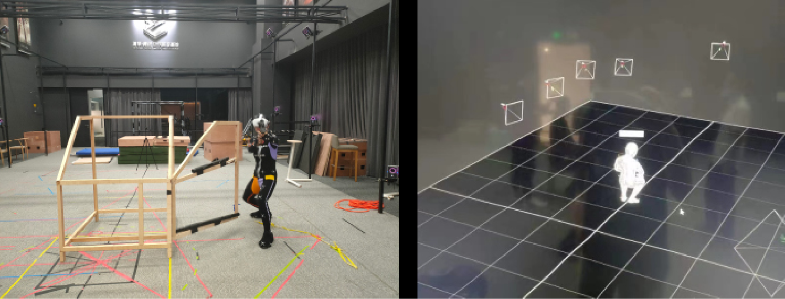
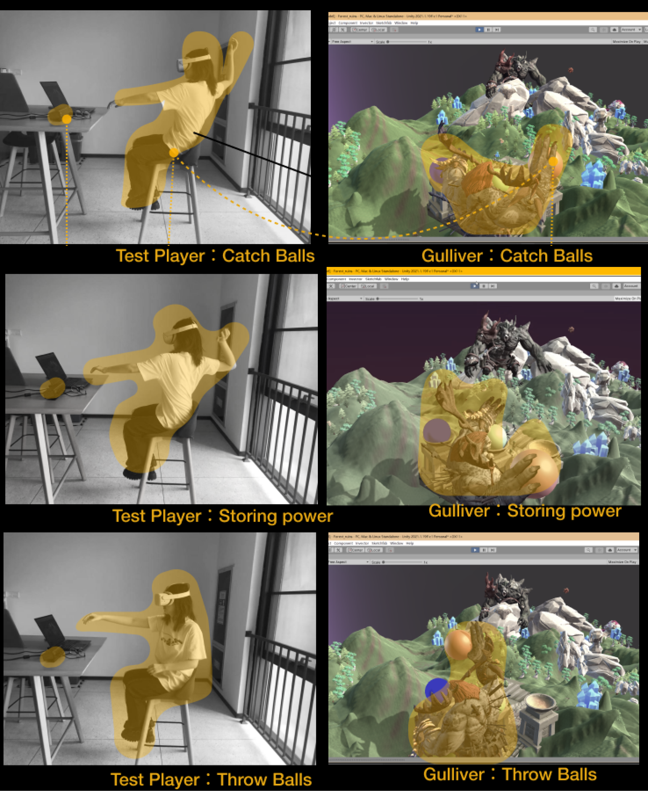

<!-- # Live Streaming # Virtual Idols

# Interactive Design # Virtual Youtuber -->

<!-- ## Table of Contents

- [Introduction](#Introduction)
  - [Recognition](#Recognition)
- [Research](#research)
  - [Definition](#definition)
  - [Contrast](#contrast)
  - [Reference](#reference)
- [Concept](#concept)
  - [About MVEAG](#about-mveag)
  - [About the Gulliver’s World](#about-the-gullivers-world)
- [GamePlay](#gameplay)
- [Technical Path](#technical-path)
- [Game shots](#game-shots)
- [Video](#video) -->

_# Live Streaming # Virtual Idols # Interactive Design # Virtual Youtuber_

## **Introduction**

With the rise of the metaverse and the concept of virtual personas, virtual hosts have become increasingly popular. While it is evident that these hosts have myriad ways to engage with their audience, most still merely chat, receive gifts, and change outfits like traditional streamers.

To enhance the interaction between Vtubers (Virtual YouTubers) and their viewers, we have designed a new game mode—Multi-Viewer Extreme Asymmetrical Game (MVEAG)—which significantly amplifies the interactivity of virtual streaming. To vividly illustrate this asymmetrical relationship, we have named this endeavor "Gulliver's Game."

### _Recognition_

2022 IEEE Conference on Games (CoG) doi: 10.1109/CoG51982.2022.9893555.

## **Research**

### _Definition_

The virtual persona industry has surged to the forefront with the advent of the metaverse. According to the "In-Depth Industry Report on Virtual Digital Humans" released by the industry service platform Quantum Bit, by 2030, the overall market size for virtual digital humans in China is expected to reach 270 billion yuan. It is foreseeable that virtual digital humans will permeate various sectors. Concurrently, the rise of live streaming has birthed the new identity of Vtuber, the virtual host.

### _Contrast_

To better understand the current state of live streaming, I conducted a study comparing top real-life hosts with virtual hosts across various dimensions. The results are as follows:

### _Reference_

Inspired by the virtual concert "Astronomical" in "Fortnite" and "Gulliver's Travels," we believe there can be a significant disparity in scale between hosts and their audiences.

  

    
  

  

    
  

## **Concept**

### _About MVEAG_

We ultimately designed the **MVEAG** model with the aim of fostering deeper engagement with our audience. It specifically targets young viewers who enjoy watching game streams.

In this new paradigm, the audience is no longer a mere spectator; they can interact with the Vtuber and participate in the interactive game. Given that live streams typically feature one host and multiple viewers, the game is crafted as a one-to-many asymmetrical experience. To vividly depict this asymmetry, we have named the project "Gulliver's World."

### _About the Gulliver’s World_

In Gulliver's World, the host embodies the role of Gulliver, while the audience takes on the role of the Lilliputians. Two Vtubers appear simultaneously on the map to engage in a duel. Gulliver cannot move across the map, thus requiring collaboration with his Lilliputian allies to attack the opposing Gulliver. The strategies for interaction between the Vtuber and the audience can be remarkably diverse.

To better guide the audience, we have designed several fundamental types of Lilliputians suited for different scenarios, where they seek out crystals, collect them, and battle enemies.

## **GamePlay**

The workflow of the gameplay is as follows:

## **Technical Path**

We then proceeded with motion capture. Initially, we experimented with optical motion capture, which yielded excellent results, but could not compute in real-time, prompting us to revise our approach.

## **Game shots**

## **Video**

  <iframe src="https://www.youtube.com/embed/KB9zi9uHsMg?si=je0Zxrw0ZHwKtVPJ&#34;" frameborder="0" style="position: absolute; width: 100%; height: 100%; left: 0; top: 0;" allowfullscreen></iframe>

<!-- <iframe width="560" height="315" src="https://www.youtube.com/embed/KB9zi9uHsMg?si=je0Zxrw0ZHwKtVPJ" title="YouTube video player" frameborder="0" allow="accelerometer; autoplay; clipboard-write; encrypted-media; gyroscope; picture-in-picture; web-share" referrerpolicy="strict-origin-when-cross-origin" allowfullscreen></iframe> -->
