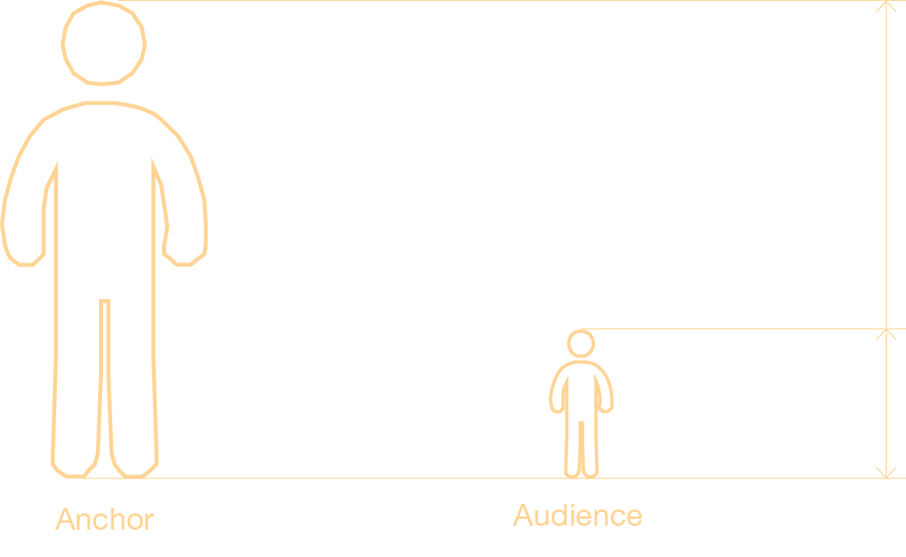

<!-- # Live Streaming # Virtual Idols

# Interactive Design # Virtual Youtuber -->

<!-- ## Table of Contents

- [Introduction](#Introduction)
  - [Recognition](#Recognition)
- [Reserach](#reserach)
  - [Definition](#definition)
  - [Contrast](#contrast)
  - [Reference](#reference)
- [Concept](#concept)
  - [About MVEAG](#about-mveag)
  - [About the Gulliver’s World](#about-the-gullivers-world)
- [GamePlay](#gameplay)
- [Technical Path](#technical-path)
- [Game shots](#game-shots)
- [Vedio](#vedio) -->

## **Introduction**

With the rise of metaverse and avatar concepts, virtual hosts have become more popular. Despite the obvious fact that virtual hosts have more ways to play with their viewers, for now, most virtual hosts are still just chatting, swiping gifts, cross-dressing, etc., like regular live streams.

In order to increase the interaction between Vtuber and viewers, we have designed a new game model - the Multiple Viewers and Vtuber Extreme Asymmetric Game (MVEAG) - which profoundly enhances the interactivity of virtual live streaming. To graphically describe this asymmetrical relationship, we have named the work Gulliver's Game.

### _Recognition_

2022 IEEE Conference on Games (CoG) doi: 10.1109/CoG51982.2022.9893555.

## **Reserach**

### _Definition_

The virtual human industry has been pulled to the forefront by the rise of the metaverse concept.According to the <Virtual Digital Human In-depth Industry Report> released by the industry service platform Quantum Bit, the overall market size of virtual digital human in China will reach RMB 270 billion by 2030.The virtual digital human is predictably penetrating various industries. At the same time, the rise of the live-streaming industry has given rise to a new identity of Vtuber (Vedio Youtuber), a virtual anchor.

<!-- 拼图块 -->
<!-- 

  
  

  The virtual human industry has been pulled to the forefront by the rise of the metaverse concept.According to the <Virtual Digital Human In-depth Industry Report> released by the industry service platform Quantum Bit, the overall market size of virtual digital human in China will reach RMB 270 billion by 2030.The virtual digital human is predictably penetrating various industries. At the same time, the rise of the live-streaming industry has given rise to a new identity of Vtuber (Vedio Youtuber), a virtual anchor.

 -->

### _Contrast_

In order to better understand the current state of live streaming, I conducted research on the top real-life hosts and virtual hosts, and compared them in various aspects. The results are as follows:

<!-- 为了更好的研究关于直播的现状，我调研了现在头部的真人
主播以及虚拟主播，并在各个方面做了对比，结果如下: -->

### _Reference_

Inspired by the "Fortnite" virtual concert Astronomical and The gulliver’s travel, We think there can be a huge size difference between the host and the audience.

  

    
  

  

    
  

## **Concept**

### _About MVEAG_

We've finally designed the **MVEAG** model with the goal of fostering deeper engagement with our audience. It is specifically targeted at young people who enjoy watching live games.

**MVEAG** is a new human-computer interaction model, Multiviewer and Vtuber Extreme Asymmetric game (MVEAG), has been designed.

Viewer is no longer a spectator of the live broadcast, but can interact with the Vtuber and participate in an interactive game. As a live stream usually contains an anchor and multiple audiences. The game is therefore designed as a one-to-many asymmetrical game. Also to describe this asymmetry graphically, we named the project 'The Gulliver's world'.

### _About the Gulliver’s World_

In the Gulliver's World, the anchor takes the role of Gulliver and the audiences takes the role of a dwarf. The two vtubers appear on the map at the same time to PK. the Gulliver cannot move around the map and therefore needs to work with his own dwarves to attack the other Gulliver. The interaction strategies between the Vtuber and the audiences can be very diverse.

To better guide the audiences, we have designed several basic types of dwarfs suitable for different scenarios, in which dwarfs search for crystals, collect them and fight against enemies.

## **GamePlay**

The gameplay workflows are as follows:

## **Technical Path**

Then we do the motion capture.We first tried optical motion capture, and the captured motion was fine, but it couldn't be calculated in real time, so we changed the scheme

## **Game shots**

## **Vedio**

  <iframe src="https://www.youtube.com/embed/KB9zi9uHsMg?si=je0Zxrw0ZHwKtVPJ" frameborder="0" style="position: absolute; width: 100%; height: 100%; left: 0; top: 0;" allowfullscreen></iframe>

<!-- <iframe width="560" height="315" src="https://www.youtube.com/embed/KB9zi9uHsMg?si=je0Zxrw0ZHwKtVPJ" title="YouTube video player" frameborder="0" allow="accelerometer; autoplay; clipboard-write; encrypted-media; gyroscope; picture-in-picture; web-share" referrerpolicy="strict-origin-when-cross-origin" allowfullscreen></iframe> -->
