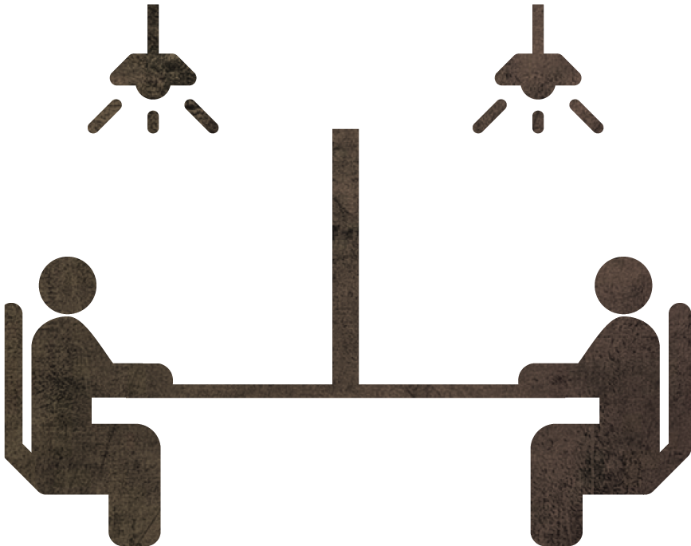

_# Exhibition Design # Desktop Game # Installation_

## **Introduction**

"Tomb Raider: Journey Through the Crypt" is a miniature tomb exploration board game.
To address the limited interactive experiences in museums, which often leave visitors lacking a true understanding of the exhibits, we have crafted this game. By weaving in dramatic elements and shifting player perspectives, we invite players to engage in the retelling of ancient artifacts' stories, allowing them to traverse time and touch history.
Two players take on the roles of an archaeologist and the spirit of a general, exploring the tomb together, communicating and collaborating to solve puzzles.
In a single glance, they traverse millennia, seeking to encounter the past, embrace history, and ultimately discover themselves.

### _Recognition_

Exhibited at the Tsinghua ICADE International Design Conference

## **Research**

During a visit to the Nanyue Museum in 2021, we realized that even when deeply immersed in the exhibits, visitors quickly forget the details once they leave the museum. This prompted us to focus on the interactive methods of museum exhibitions.
We also conducted extensive interviews with museum-goers, gathering the following insights.

### _Empathy Map_

Through empathy research, we captured the emotional journey of visitors, as illustrated below.

### _Conclusion_

From our findings, we concluded that:

- Visitors perceive museums as heavy and serious.
- The exhibition formats are quite limited, primarily relying on direct displays.
- Interactive experiences are monotonous.
- It is challenging to truly remember the stories and histories behind the exhibits.

## **Concept**

To tackle the issue of limited interactivity in museums, I designed a board game that leverages the concept of information asymmetry. In this game, players cannot see each other. They must continuously communicate and exchange information to break through the puzzles and piece together a complete story.

### _Information Gap_

By incorporating the differences in social customs between ancient and modern times into the puzzles, players can better experience these contrasts through the lens of information asymmetry.

### _Immersive Theatrical Experience_

Players embody characters from two different eras, reading aloud their respective monologues, fully immersing themselves in their roles.

### _Switching Perspectives_

Unlike the parallel perspectives of museum visits, this game offers players a unique god-like view through miniature models.

  

    
  

  

    
  

## **Game Design**

### _Character Design_

### _Gameplay_

**Game Members:** Two players and one DM

**Game Start:**

- The players cannot see each other and must communicate solely through sound.
- Players read the monologues of their characters for each round while gathering information from the tomb.
  
- Each round provides props, and players must read the corresponding monologues to solve the puzzles.
- Staff will adjust the lighting according to the storyline.
  

**Game End:**

- Once the players have solved all the puzzles, the general and the archaeologist finally meet.
- Together, they piece together the long-buried past...
  

### _Puzzle Design_

Here are some selected puzzles I designed.

### _Level Design_

The specific level and map designs are as follows:

  

    
  

  

    
  

### _Workflow_

