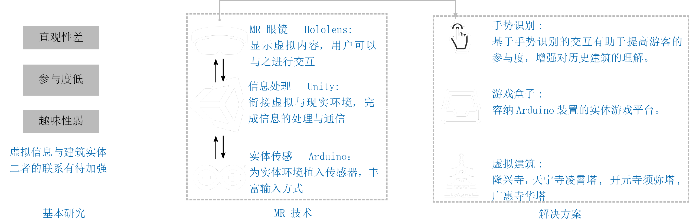
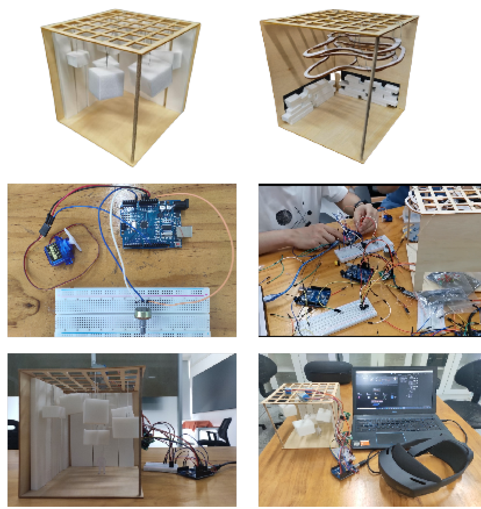
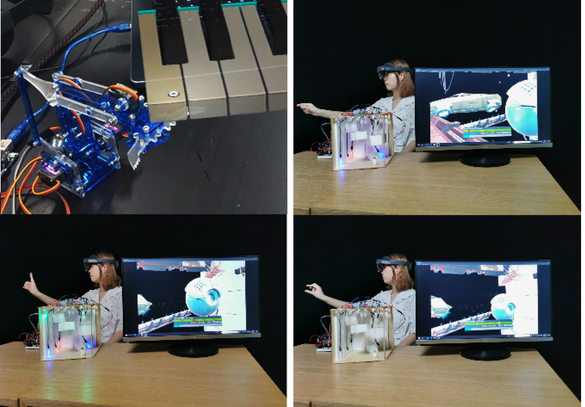
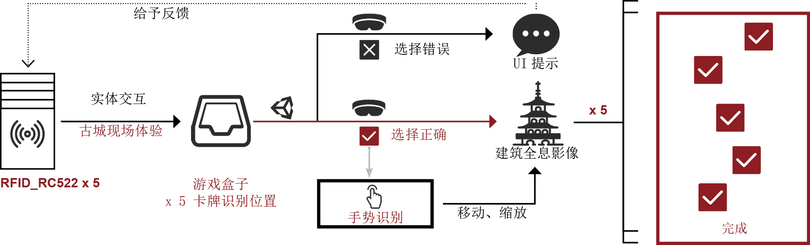
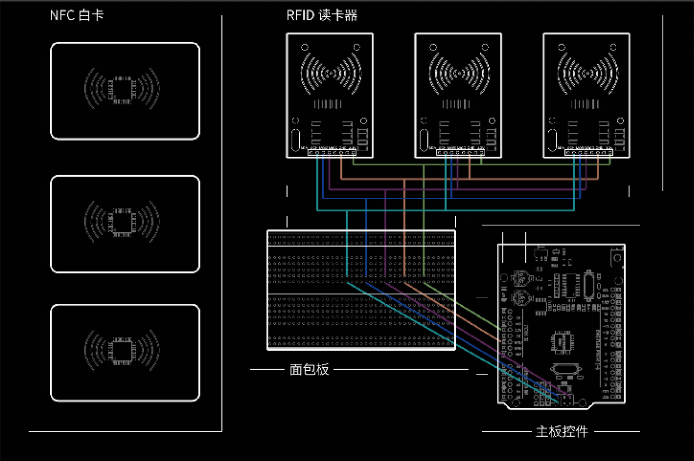
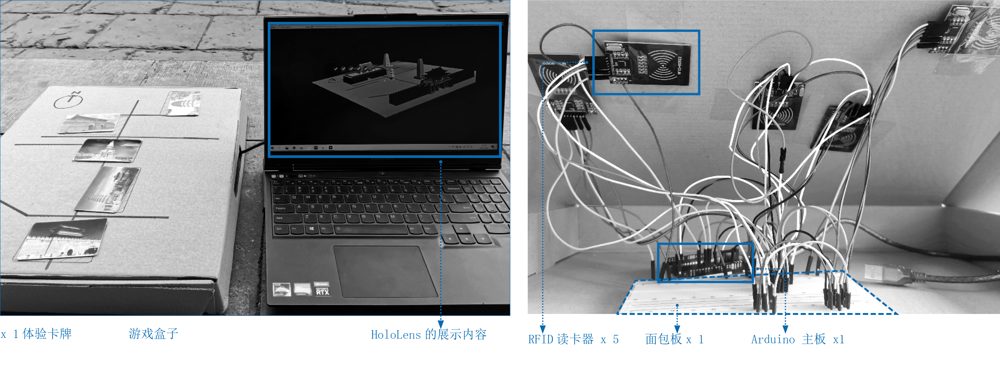
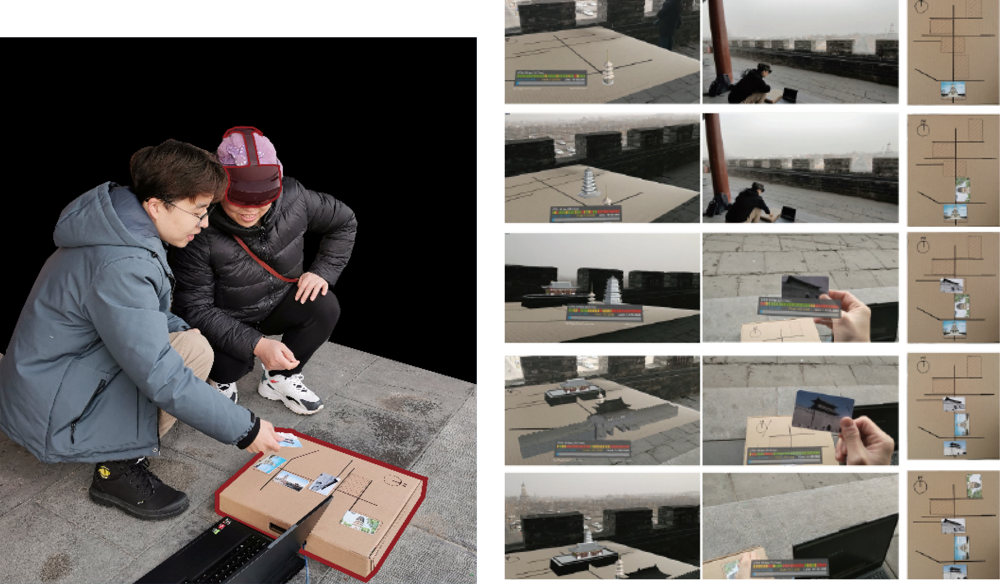

_# Virtual Reality Interaction # Installation_

## **Introduction**

Holo, Chaoshan is an MR interactive project that envisions a harmonious interplay between the tangible world and virtual realms. In this endeavor, I have orchestrated a symphony of interaction between Hololens (the MR device) and Arduino. The first phase: Hololens to Arduino, where gestures command the virtual environment, setting the physical space in motion. The second phase: Arduino to Hololens, where hardware interactions transform the scenes within the virtual landscape. This project collaborates with local enterprises in Chaoshan, exploring the potential for commercial application.

<!-- ### _Recognition_

2022 IEEE Conference on Games (CoG) doi: 10.1109/CoG51982.2022.9893555。 -->

## **Research**

### _Situation & Concept_

As we wandered through ancient architecture, the remnants of history left these structures as mere shadows of their former glory, making it difficult to envision their past splendor. Conversely, the advancement of MR technology has made it possible to interact with virtual objects within real spaces. Thus, this project aspires to utilize MR technology, allowing visitors to discover the beauty of history through a novel interaction between virtual and physical realms. We have also designed interactive games to enhance the immersive experience for our guests.

## **Process**

### _Installation_

We began by constructing a wooden installation to simply illustrate our real-world setting.

### _Period 1: Hololens -> Arduino_

Initially, we achieved the ability to control the virtual scene via Hololens, thereby influencing the physical space through Arduino hardware. As depicted, Figure 1 shows what we see within Hololens, where a virtual piano materializes in the real environment. Figures 2-4 illustrate our usage scenarios, where gestures manipulate elements in the virtual scene, triggering movements in the physical world.

You can view the complete demonstration video here.
 
 

  <iframe src="https://www.youtube.com/embed/M3YLMt48Pyc?si=ORm6wSVfwG7t9KTB" frameborder="0" style="position: absolute; width: 100%; height: 100%; left: 0; top: 0;" allowfullscreen></iframe>

<!-- <iframe width="560" height="315" src="https://www.youtube.com/embed/M3YLMt48Pyc?si=ORm6wSVfwG7t9KTB" title="YouTube video player" frameborder="0" allow="accelerometer; autoplay; clipboard-write; encrypted-media; gyroscope; picture-in-picture; web-share" referrerpolicy="strict-origin-when-cross-origin" allowfullscreen></iframe>
### _Period 2_ -->
 
To further immerse visitors in their exploration, we implemented a feature that allows them to influence the virtual scenes in Hololens through RFID card control.

<!-- 

  

    
  

  

    
  

 -->

### _Field Test_

The final field tests are as follows:

