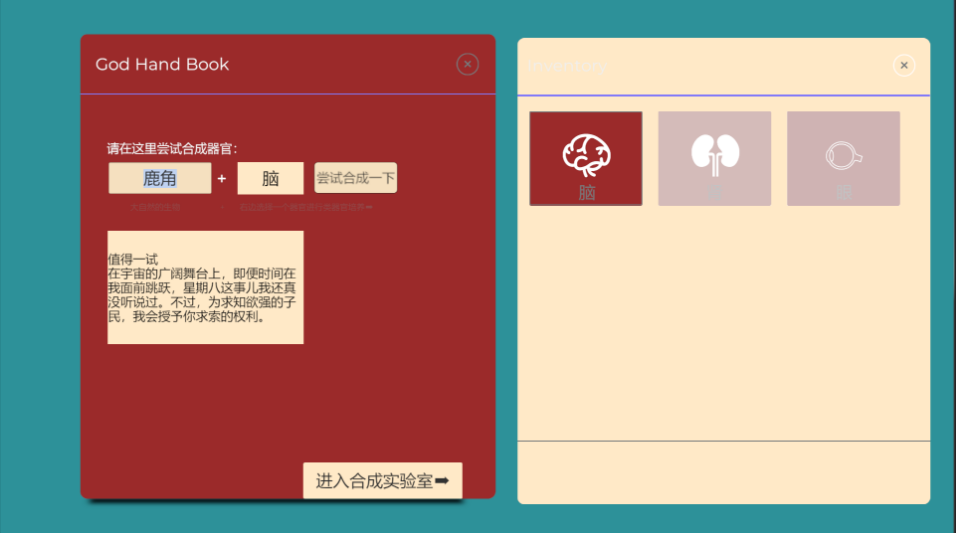
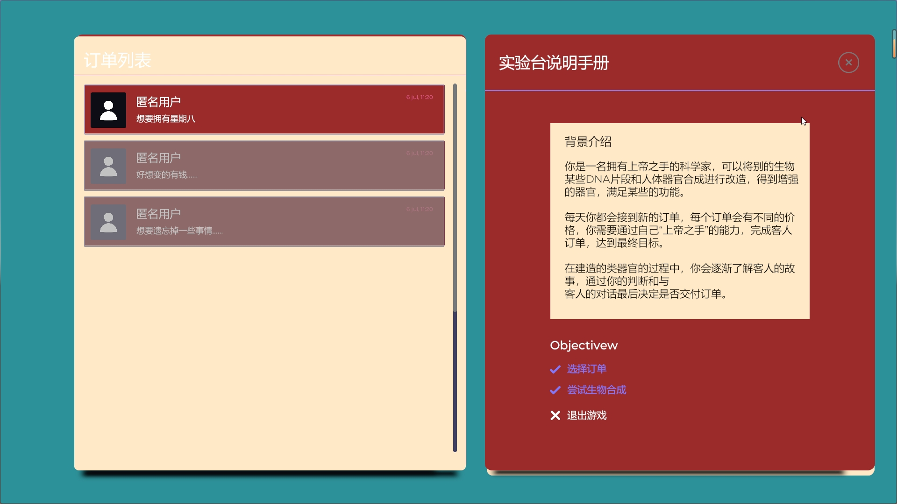
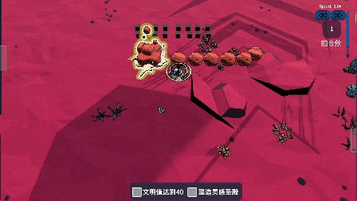
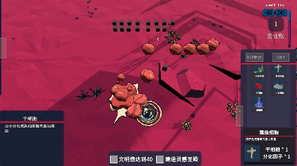
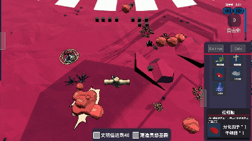
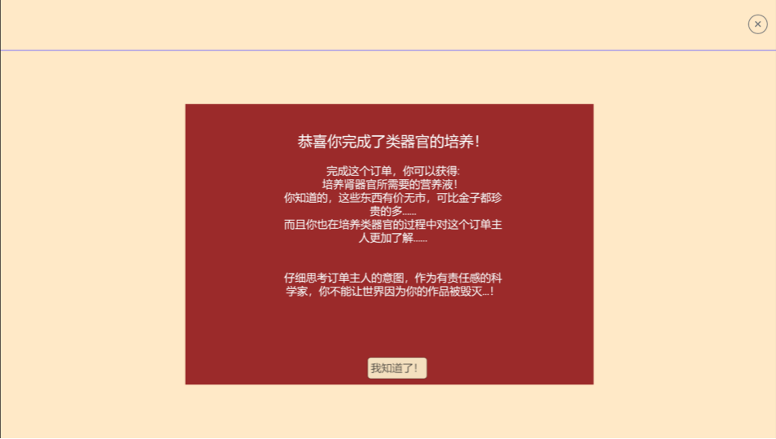

_# AI Native # RTS  # Narrative_

## **Introduction**

玩家是一位拥有上帝之手的生物科学家夏娃，每天会收到各种离奇的培养类器官的订单。
因此玩家需要携带各种生物的“灵感 DNA 片段”进入培养槽中参与类器官城市文明的建造。
随着类器官城市的建造，细胞之间的语言会逐渐清晰，文明逐渐出现，细胞背后主人的故事也将浮出水面……

<!-- ### _Recognition_

2022 IEEE Conference on Games (CoG) doi: 10.1109/CoG51982.2022.9893555。 -->

## **Reserach**

### _Organoid_

类器官（organoid）是一种由干细胞或组织细胞在体外培养形成的微型三维组织结构，模仿了器官的特性和功能。类器官的出现为生物医学研究提供了新的模型，能够更好地模拟人体器官的发育、疾病机制和药物反应。
在类器官的研究中，很多实验会通过研究鹿角上面的再生细胞来模拟人体表皮再生的过程。
这种需要从大自然之手创造的生物中汲取灵感，转而促进人类之手创造一个“类”器官的过程给予了我们很大启发。
因此决定在游戏中模拟一个需要结合各种灵感生物从而创造出自己的器官的科学家的游戏。
希望通过这个游戏，玩家可以认识到类器官这一个研究领域并且体验到”灵感“的乐趣。

## **Game Play**

### _Step1:_

局外：选择你想要完成的订单，并且选择合适的器官以及灵感生物进行 AI 合成

<!-- 

  

    
  

  

    
  

 -->

### _Step2:_

局内：进行细胞培养，建造经营。随着细胞的培养，会逐渐衍生出城市，城市会逐渐产生文明。
在局内一共实现了包括建造系统，回合系统，营养系统，压力系统等等。

初始干细胞

合成建筑细胞

合成红细胞

派出探索小队

### _Step3:_

当局内类器官成功合成之后，最终会将其交付到订单主人手中。并且在培养的过程中玩家也将逐渐了解订单主人背后的故事，解开谜题。

<!-- 

  

    
  

  

    
  

 -->

## **cells**

我们创建了大约 17 种建筑，代表类器官培养过程中的建筑。

<!-- 

  <video controls style="position: absolute; width: 100%; height: 100%; left: 0; top: 0;">
    <source src="Holo,Chaoshan.mp4;" type="video/mp4">
  </video>

 -->
