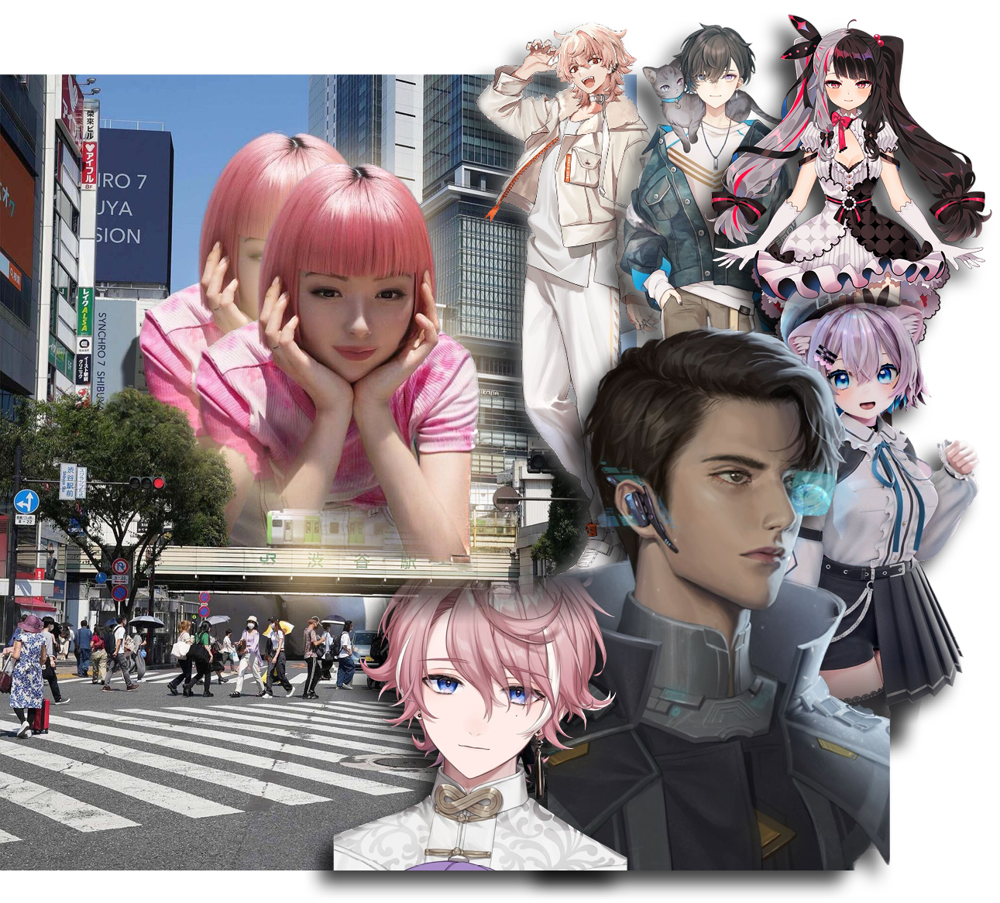
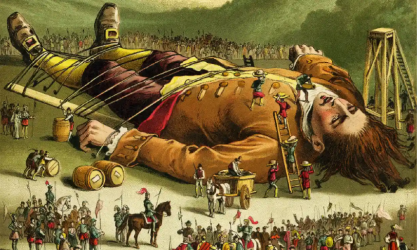
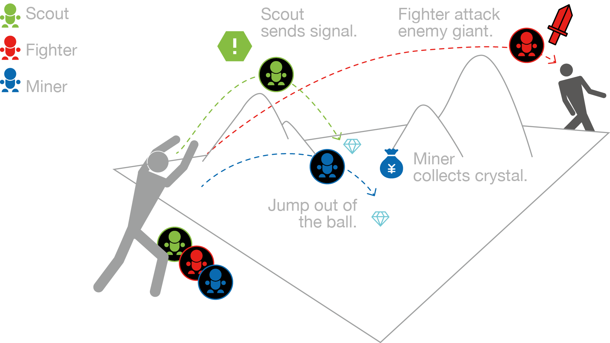

<!-- # Live Streaming # Virtual Idols

# Interactive Design # Virtual Youtuber -->

<!-- ## Table of Contents

- [Introduction](#Introduction)
  - [Recognition](#Recognition)
- [Reserach](#reserach)
  - [Definition](#definition)
  - [Contrast](#contrast)
  - [Reference](#reference)
- [Concept](#concept)
  - [About MVEAG](#about-mveag)
  - [About the Gulliver’s World](#about-the-gullivers-world)
- [GamePlay](#gameplay)
- [Technical Path](#technical-path)
- [Game shots](#game-shots)
- [Vedio](#vedio) -->

_# Live Streaming # Virtual Idols # Interactive Design # Virtual Youtuber_

## **Introduction**

随着元宇宙和虚拟形象概念的兴起，虚拟主持人变得越来越流行。尽管显而易见，虚拟主持人有更多的方式与观众互动，但目前大多数虚拟主持人仍然只是像常规直播一样聊天、刷礼物、变装等。

为了增加 Vtuber（虚拟 YouTuber）与观众之间的互动，我们设计了一种新的游戏模式——多观众与 Vtuber 极端非对称游戏（MVEAG），这极大地增强了虚拟直播的互动性。为了形象地描述这种非对称关系，我们将这项工作命名为“格列佛的游戏”。

### _Recognition_

2022 IEEE Conference on Games (CoG) doi: 10.1109/CoG51982.2022.9893555。

## **Reserach**

### _Definition_

虚拟人产业因元宇宙概念的兴起而被推向前沿。根据行业服务平台量子比特发布的《虚拟数字人深度行业报告》，到 2030 年，中国虚拟数字人的整体市场规模将达到 2700 亿元人民币。可以预见，虚拟数字人将渗透到各个行业中。同时，直播行业的兴起催生了 Vtuber（视频 YouTuber）这一新身份，即虚拟主播。

### _Contrast_

为了更好地了解当前直播的状态，我对顶级真人主持人和虚拟主持人进行了研究，并在各个方面进行了比较。结果如下：

### _Reference_

受到“堡垒之夜”虚拟音乐会《天文》和《格列佛游记》的启发，我们认为主持人和观众之间可以存在巨大的大小差异。

  

    
  

  

    
  

## **Concept**

### _About MVEAG_

我们最终设计了**MVEAG**模型，目标是与我们的观众建立更深入的参与。它特别针对喜欢观看游戏直播的年轻人。

观众不再是直播的旁观者，而是可以与 Vtuber 互动并参与互动游戏。由于直播通常包含一个主播和多个观众，因此游戏被设计为一种一对多的非对称游戏。同时，为了形象地描述这种非对称性，我们将项目命名为“格列佛的世界”。

### _About the Gulliver’s World_

在格列佛的世界中，主播扮演格列佛的角色，观众扮演矮人的角色。两个 Vtuber 同时出现在地图上进行 PK。格列佛不能在地图上移动，因此需要与自己的矮人合作攻击另一个格列佛。Vtuber 与观众之间的互动策略可以非常多样化。

为了更好地引导观众，我们设计了几种适合不同场景的基本类型的矮人，其中矮人寻找水晶，收集它们并与敌人战斗。

## **GamePlay**

游戏玩法的工作流程如下：

## **Technical Path**

然后我们进行动作捕捉。我们首先尝试了光学动作捕捉，捕捉到的动作很好，但不能实时计算，所以我们改变了方案。

## **Game shots**

## **Vedio**

  <iframe src="https://www.youtube.com/embed/KB9zi9uHsMg?si=je0Zxrw0ZHwKtVPJ&#34;" frameborder="0" style="position: absolute; width: 100%; height: 100%; left: 0; top: 0;" allowfullscreen></iframe>

<!-- <iframe width="560" height="315" src="https://www.youtube.com/embed/KB9zi9uHsMg?si=je0Zxrw0ZHwKtVPJ" title="YouTube video player" frameborder="0" allow="accelerometer; autoplay; clipboard-write; encrypted-media; gyroscope; picture-in-picture; web-share" referrerpolicy="strict-origin-when-cross-origin" allowfullscreen></iframe> -->
