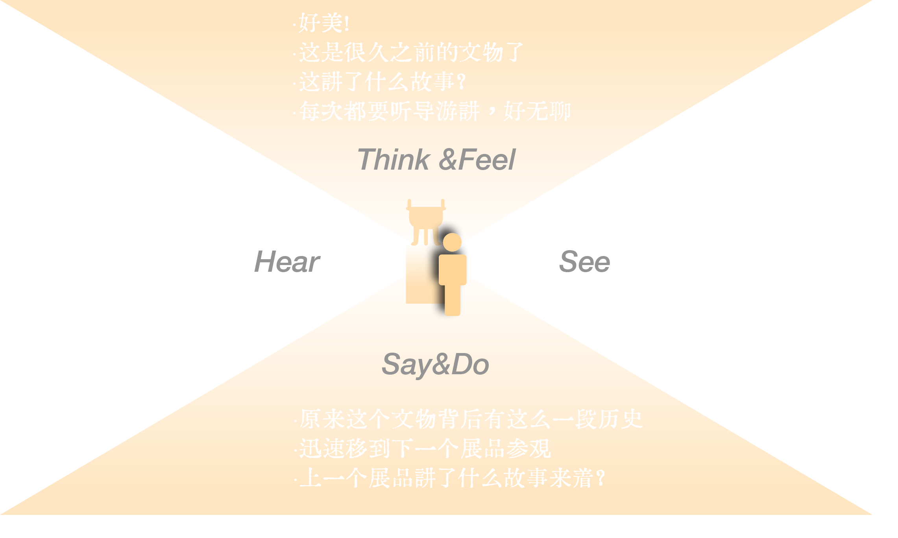

## **Introduction**

《墓室·探途》是一款微缩墓室探索桌面游戏。
为了解决博物馆交互形式有限，参观者缺少对展品真正的理解问题，我们设计了一款微缩墓室探索桌面游戏，通过融入戏剧元素以及转换玩家视角的方式，让玩家参与到重构的文物故事中，以此拥有穿越时空、触碰历史的震撼
两位玩家分别以考古学者和将军亡魂的身份探索墓室，沟通合作进行解谜。
一眼，穿越千年，只为遇见过去，遇见历史，也遇见自己。

### _Recognition_

清华ICADE 国际设计大会在展

## **Reserach**

2021年在一次参观南越博物馆的时候，我们发现即使看展时非常沉浸在展品中，但出了博物馆之后很快会忘记展品的细节。于是我们开始关注博物馆展览的交互方式。
同时，我们也对参观博物馆的游客做了大量的访谈，得到了如下的数据。

## **Empathy Map**
此外，通过同理心调研，我们可以得到参观者的心路历程如下图所示

### _Conclusion_
最终我们从数据中总结出了结论：
- 游客对于博物馆的印象是沉重的，严肃的。
- 博物馆的展出形式方式十分有限，多以直接展出为主。
- 互动形式单一
- 很难真正记住展品背后的故事和历史。

## **concept**
为了解决博物馆交互形式有限的问题，我利用信息差设计了一款桌面游戏。在游戏里，双方互相看不见。通过需要双方不断沟通，交换信息，打破迷局，才能拼凑出一整个完整的故事。

### _Information gap_
把古代和现代的社会风俗等差异设计进谜题，通过信息差解题，有利于游玩者更好的体验到差异性
### _immersive theatrical experience_
玩家分别扮演两个时代人物，并且朗读所属身份的独白，沉浸带入角色。
### _Switching perspectives_
不同于参观博物馆的平行视角，通过微缩模型实现了游玩者独特的上帝视角体验

  

    
  

  

    
  

## **Game design**
### _Character Design_

### _Game play_

### _Puzzle Design_
在这里节选了部分我设计的谜题

### _Puzzle Design_
具体的关卡设计以及地图设计如下所示

  

    
  

  

    
  

### _Workflow_
