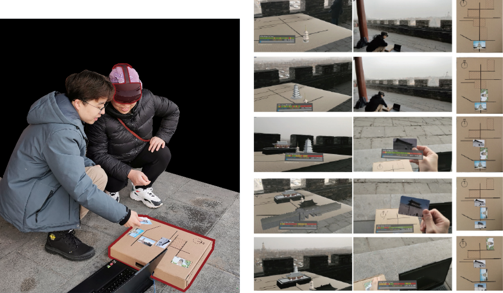

_# Virtual Reality Interaction # Installation_

## **Introduction**

Holo, Chaoshan 是一个 MR 虚拟空间交互项目，设想了现实空间和虚拟场景的互动交互。在这个项目中，我实现了 Hololens（MR 设备）和 Arduino 的相互联动。第一阶段：Hololens-->Arduino 通过用手势控制虚拟环境中的物体，从而带动现实空间的移动.第二阶段：Arduino--> Hololens 通过硬件交互，导致虚拟环境中场景发生改变。
这个项目和潮汕当地企业合作，尝试了商业落地。

<!-- ### _Recognition_

2022 IEEE Conference on Games (CoG) doi: 10.1109/CoG51982.2022.9893555。 -->

## **Reserach**

### _Situation&Concept_

在我们参观古建筑的时候，历史的痕迹让这些建筑只留下断垣残壁，很难想象到昔日的景象。另一方面，MR 技术的发展让在现实空间中和虚拟物体进行交互成为可能，因此本项目希望使用 MR 技术，让游客在参观景象的时候，可以通过虚拟空间和现实空间交互的方式，以一种全新的方式发现历史的美。并且设计了一些互动游戏的方式，增加游客的沉浸体验。

## **Process**

### _Installation_

我们首先搭建了一个木头装置，来简单示意我们的现实场景。

### _Period1：Hololens->Arduino_

首先我们实现了通过 Hololens 控制虚拟场景从而影响现实空间(Arduino 硬件实现)的功能。如图所示，图 1 展示了我们在 Hololens 里面看到的内容，虚拟的钢琴出现在现实的场景当中。图 2-4 展示了我们的使用场景。通过用手势控制虚拟场景里面的东西从而引发现实空间中的移动

完整的演示视频可以在这里看到。
 
 

  <iframe src="https://www.youtube.com/embed/M3YLMt48Pyc?si=ORm6wSVfwG7t9KTB" frameborder="0" style="position: absolute; width: 100%; height: 100%; left: 0; top: 0;" allowfullscreen></iframe>

<!-- <iframe width="560" height="315" src="https://www.youtube.com/embed/M3YLMt48Pyc?si=ORm6wSVfwG7t9KTB" title="YouTube video player" frameborder="0" allow="accelerometer; autoplay; clipboard-write; encrypted-media; gyroscope; picture-in-picture; web-share" referrerpolicy="strict-origin-when-cross-origin" allowfullscreen></iframe>
### _Period2_ -->
 
为了能够让参观者可以在参观的时候更加沉浸的和虚拟空间交互，我们实现了通过控制 RFID 卡片从而影响 Hololens 中虚拟场景的功能。

<!-- 

  

    
  

  

    
  

 -->

### _Field Test_

最终实际场景测试如下：

